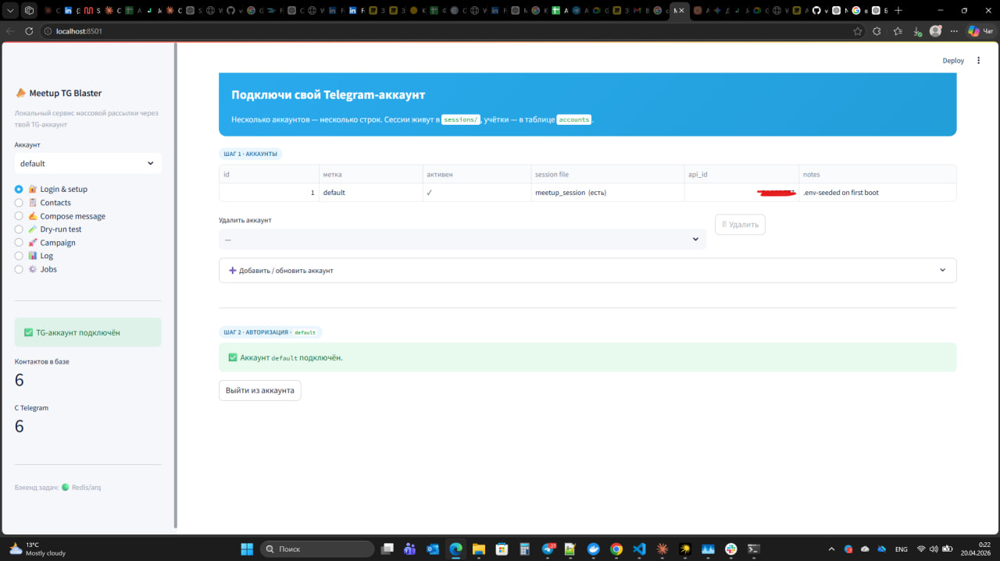
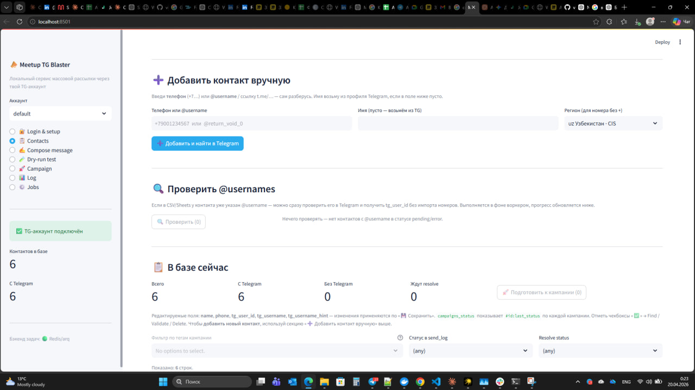
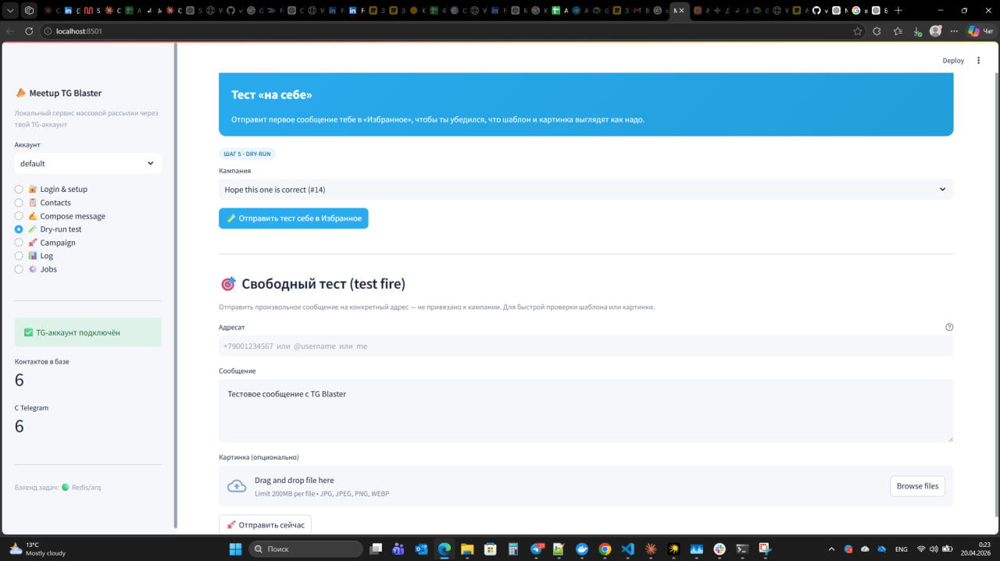
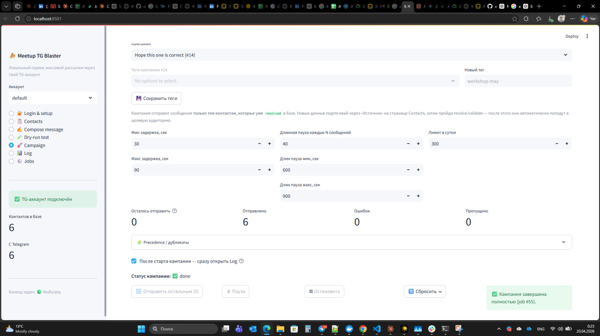
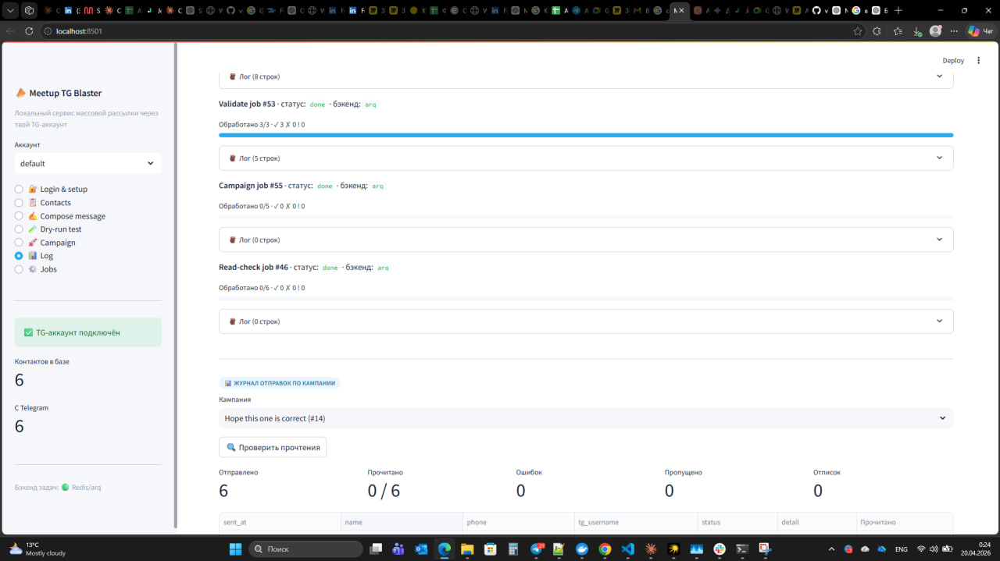
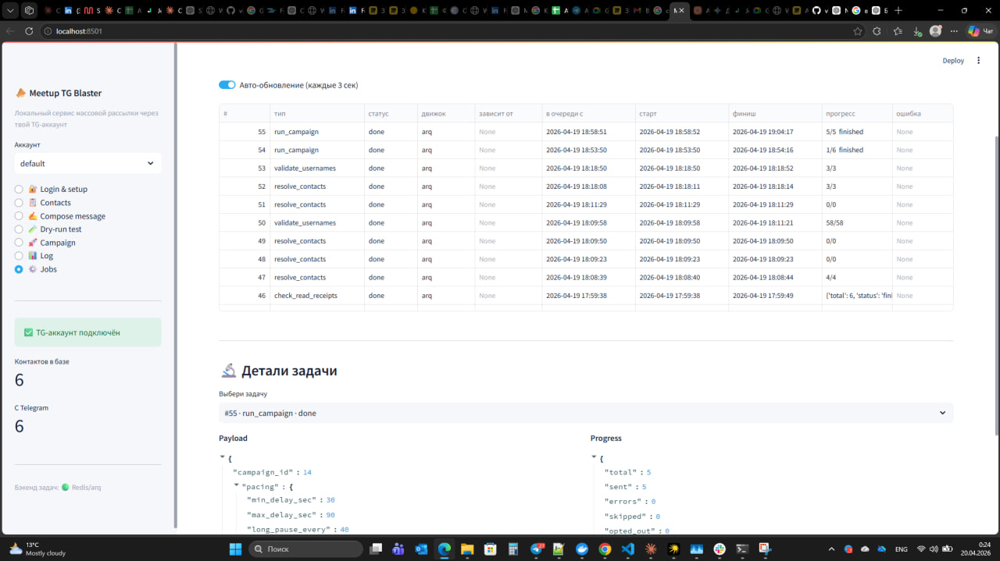

# TGBlaster

**Self-hosted инструмент массовой Telegram-рассылки для opt-in аудитории —
приглашай зарегистрировавшихся на твой митап, пиши своим подписчикам,
гони drip-кампании по своей базе клиентов. Работает как три Docker-сервиса
на ноутбуке или на VPS за €4/мес.**

> 🇬🇧 [English README](./README.md)

---

## ⚠️ Прочти перед использованием

Telegram **запрещает массовые сообщения тем, кто на них не подписывался**.
Холодная рассылка по купленной или спарсенной базе приведёт к бану
аккаунта — и TGBlaster от этого не защитит. Используй только для
аудитории, которая активно ждёт от тебя сообщений.

Перед первой кампанией — прочти **[DISCLAIMER.md](./DISCLAIMER.md)**
целиком. Там про ToS Telegram, GDPR и границы того, от чего этот софт
НЕ может защитить.

---

## Скриншоты

| | |
|---|---|
|  |  |
|  |  |
|  |  |

---

## Что делает

1. **Загружает контакты** из CSV (гибкие имена колонок; российские и
   узбекские форматы номеров нормализуются до E.164).
2. **Ищет номера в Telegram** через `ImportContactsRequest` батчами по
   100 с автоматической очисткой.
3. **Валидирует `@usernames`** для контактов, у которых есть хэндл, но
   нет телефона.
4. **Персонализирует сообщения** — `{first_name}`, `{name}`,
   `{group_link}`, плюс любая колонка CSV как `{placeholder}`.
5. **Отправляет по-человечески**: случайная пауза 30–90 сек, длинная
   пауза 10–15 мин каждые 40 сообщений, настраиваемый дневной лимит,
   автоматическая остановка на `PeerFloodError`.
6. **Resume after crash**: прогресс чекпоинтится в SQLite; убитый
   воркер подхватит ровно с того места, где упал, через журнал
   идемпотентности.
7. **Трёхуровневый дедуп**: дубли телефонов в одном CSV, два телефона
   одного TG-пользователя, «не пиши этому человеку N дней» между
   кампаниями.
8. **Read-receipts**: вручную триггеришь батчевый
   `GetPeerDialogsRequest` — для прочитанных сообщений флажок `read_at`
   в журнале.
9. **CRUD кампаний**: редактировать, клонировать, удалять прошлые
   кампании — не надо каждый раз собирать шаблон заново.
10. **Предпросмотр на 5 устройствах**: Compose показывает, как
    сообщение будет выглядеть в клиентах iPhone, iPad, Android, Desktop
    и Web (шрифты, радиусы пузырей, цвета ссылок — по клиенту).

---

## Архитектура

```
┌─────────────────────┐      ┌──────────┐      ┌──────────────────┐
│  Streamlit UI       │◀────▶│  Redis   │◀────▶│  arq воркер      │
│  (app.py, :8501)    │      │  (queue) │      │  (core/jobs.py)  │
└──────────┬──────────┘      └──────────┘      └────────┬─────────┘
           │                                             │
           └────────────────┬────────────────────────────┘
                            ▼
             ┌──────────────────────────────┐
             │  SQLite (data/state.db)      │
             │  + Telethon session          │
             │  + загруженные картинки      │
             └──────────────────────────────┘
```

- **UI** — рендерит страницы Streamlit; Dry-run и test-fire бегут
  in-process.
- **Воркер** — реальные кампании, resolve, validate, read-check, +
  watchdog cron.
- **Redis** — очередь arq, распределённые локи, сигналы pause/stop.
- **SQLite** — единый источник правды: контакты, кампании, send_log,
  jobs.

Полный дизайн — в [docs/ARCHITECTURE.md](./docs/ARCHITECTURE.md).

---

## Быстрый старт (Docker)

```bash
git clone https://github.com/viktordrukker/tgblaster.git
cd tgblaster
cp .env.example .env       # потом отредактируй — см. «API-креды» ниже
docker compose up -d --build
```

Открой <http://localhost:8501> — и пройди 8 шагов (логин → импорт →
resolve → compose → dry-run → кампания → лог → jobs).

Стоп: `docker compose down`. Состояние в `data/`, `sessions/`,
`uploads/` переживёт.

### Получить API-креды Telegram

1. <https://my.telegram.org> → логин тем номером, с которого будешь
   слать.
2. API development tools → создай новое приложение (имя любое).
3. Скопируй `api_id` и `api_hash` в `.env`:
   ```ini
   TG_API_ID=123456
   TG_API_HASH=0123456789abcdef0123456789abcdef
   TG_SESSION_NAME=tg_session
   ```

Все настройки — в [docs/CONFIGURATION.md](./docs/CONFIGURATION.md).

---

## Варианты установки

- **[docs/DEPLOYMENT.md](./docs/DEPLOYMENT.md)** — локальный Docker
  (быстрый старт этого README), Hetzner VPS с Caddy + basic-auth, bare
  metal systemd, PaaS-варианты.
- **[docs/DEVELOPMENT.md](./docs/DEVELOPMENT.md)** — запуск тестов,
  добавить новый тип job, добавить UI-страницу.
- **[docs/TROUBLESHOOTING.md](./docs/TROUBLESHOOTING.md)** — `FloodWait`,
  `PeerFlood`, «database is locked», конфликт на session-файле, прочие
  повторяющиеся ошибки.

---

## Стек

- **Python 3.11**
- **Streamlit 1.40** — UI
- **Telethon 1.43** — MTProto клиент
- **arq 0.26** — асинхронная очередь на Redis
- **SQLite** в WAL-режиме — single-node persistence
- **Docker Compose** — три сервиса

---

## Contributing

PR welcome. Воркфлоу, стиль коммитов и как триажатся issue —
в [CONTRIBUTING.md](./CONTRIBUTING.md).

Баги безопасности — приватно через GitHub
[security advisory](https://github.com/viktordrukker/tgblaster/security/advisories/new) —
**не** в публичный issue. См. [SECURITY.md](./SECURITY.md).

---

## Лицензия

[MIT](./LICENSE). Делай что хочешь, включая коммерческое использование.
Единственное, чего нельзя — это делать вид, что авторы отвечают за
твою политику рассылки. См. **[DISCLAIMER.md](./DISCLAIMER.md)**.
